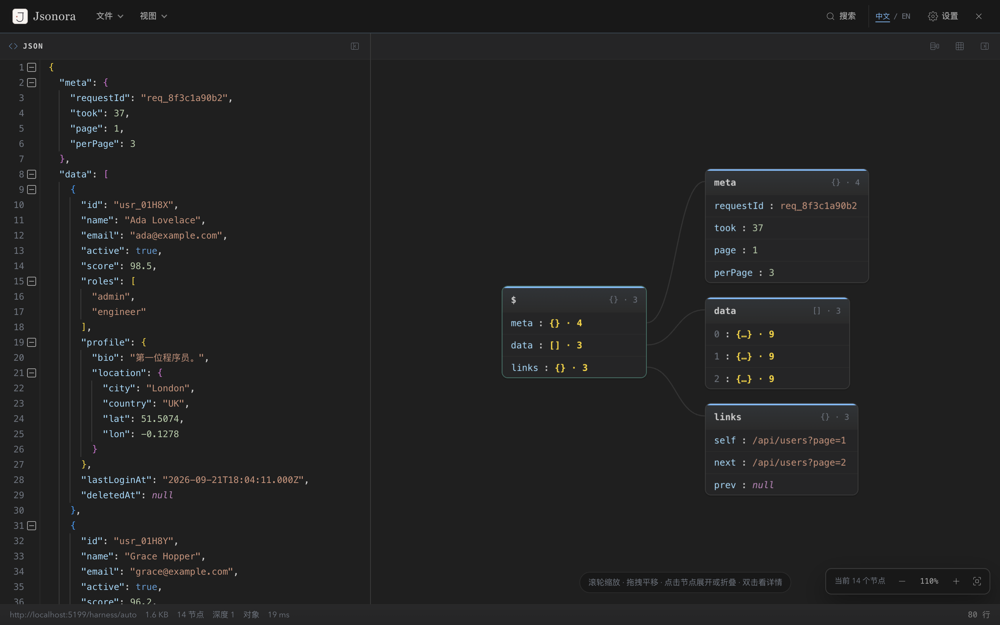

<p align="center">
  
</p>

<h1 align="center">Jsonora</h1>

<p align="center">简体中文 · <a href="README.en.md">English</a></p>

<p align="center">让 JSON 从一整页字符，变成清晰可读的结构。</p>

<p align="center">Chrome 扩展 · 原始 JSON / 图形 / 树形 · 本地处理 · MIT 开源</p>



Jsonora 会在 JSON 响应页显示双栏工作台：左侧保留可编辑、可折叠的原始 JSON，右侧在紧凑图形和虚拟滚动树形之间切换。普通网页中的 JSON 代码块也能按需就地展开；界面提供中英文和多套明暗配色。

## 从这些场景开始

| 你正在做什么 | Jsonora 的入口 |
| --- | --- |
| 阅读 API 返回的 JSON | 直接打开接口地址，自动显示原始 JSON 与结构视图 |
| 检查粘贴或本地文件 | 使用「文件 → 粘贴 / 打开文件」，也可拖入 `.json` |
| 阅读网页里的 JSON 示例 | 点击页面上的渲染提示，就地展开 JSON 代码块 |
| 定位复杂字段 | 搜索文本或正则，在图形/树形视图中展开路径并查看节点详情 |
| 调试网络响应 | 打开 Chrome DevTools 的 Jsonora 面板 |

容错解析支持注释、尾随逗号、单引号、JSONP、NDJSON 等常见输入，并会提示无法恢复的错误位置。图形默认使用紧凑卡片，画布网格默认关闭；视图、字体和主题都可调整。详细操作见 [使用指南](docs/USAGE.md)。

## 立即体验

尚未上架 Chrome Web Store，可先从源码加载。需要 Node.js `^20.19.0` 或 `>=22.12.0`：

```bash
npm ci
npm run build
```

在 `chrome://extensions` 开启「开发者模式」→「加载已解压的扩展程序」→ 选择项目中的 `dist/`。不要选择 ZIP 文件或 Chrome 的临时 `UnpackedExtensions` 目录。随后打开一个 JSON 接口，或点击扩展图标粘贴 JSON。修改源码后重新构建，并在扩展列表中刷新。如果手里只有发布 ZIP，请先解压，再选择其中包含 `manifest.json` 的文件夹。

要生成供商店上传的 ZIP，运行 `npm run zip`。实际提交流程和上架前检查见 [打包与发布](docs/RELEASING.md)；构建脚本不会自动发布。

## 文档

- [使用指南](docs/USAGE.md)：视图、编辑、搜索、快捷键与限制
- [开发指南](docs/DEVELOPMENT.md)：环境、命令、结构和验证
- [打包与发布](docs/RELEASING.md)：Chrome Web Store 提交清单
- [商店资料草稿](docs/STORE-LISTING.md)：双语简介、权限理由和审核测试说明
- [隐私说明](docs/PRIVACY.md)：页面内容、临时存储和扩展权限
- [品牌与 Logo](docs/BRAND.md)：矢量稿、PNG 图标和用色
- [设计说明](docs/DESIGN-BRIEF.md)：设计迭代的内部参考
- [参与贡献](CONTRIBUTING.md)：问题报告与代码提交

问题与建议可在 [GitHub Issues](https://github.com/sowen1023/Jsonora/issues) 提出；请勿附上真实接口数据或凭据。

Jsonora 在浏览器本地解析 JSON；跨页面打开内容时会短暂使用扩展本地存储，设置可能使用 Chrome 同步存储。请阅读 [隐私说明](docs/PRIVACY.md) 了解具体边界。

## 许可

源码和随附文档采用 [MIT License](LICENSE)。发布 ZIP 还附带运行时依赖的许可声明 `THIRD_PARTY_NOTICES.txt`。
